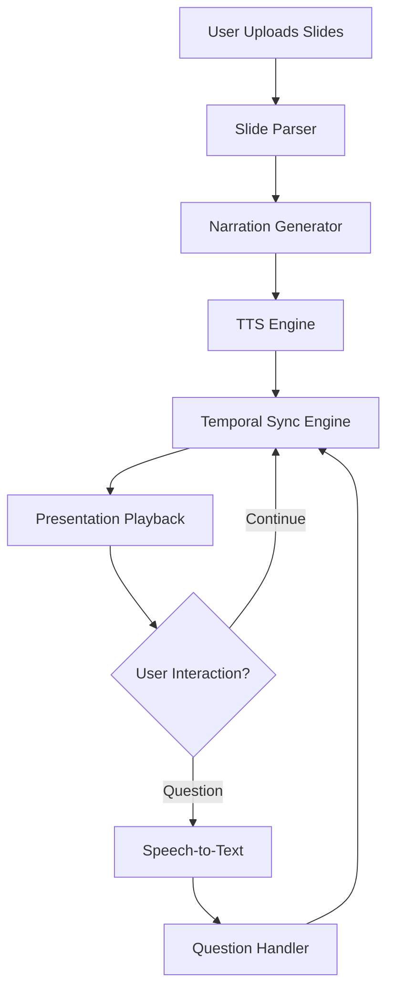

# Demo Implementation

PresentLM is implemented as a modular, AI-driven presentation system that synchronizes slide progression, spoken narration, and real-time interaction.

  <strong>The system treats slides as temporal reference points, shaping:</strong>
  <ul style={{ listStyle: 'none', padding: 0, margin: '1em 0 0 0' }}>
    <li>✓ What is said</li>
    <li>✓ When it is said</li>
    <li>✓ How explanations unfold</li>
  </ul>

---

## Core Components

  

### 1. Slide Parser

  <strong>Technology:</strong> Document Parser, optionally VLMs for image-heavy slides
    
  <strong>Function:</strong> Extracts textual and structural information from uploaded slide decks (PDF, PPT).

### 2. Narration Generator

  <strong>Technology:</strong> LLM (Large Language Model)
    
  <strong>Function:</strong> Generates structured, slide-aligned spoken explanations using slides and optional notes as grounding context.

### 3. Text-to-Speech (TTS)

  <strong>Technology:</strong> TTS Engine
    
  <strong>Function:</strong> Converts narration into natural speech with controlled pacing and emphasis.

### 4. Temporal Synchronization Engine

  <strong>Technology:</strong> Custom Synchronization System
    
  <strong>Function:</strong> Automatically advances slides in sync with narration.

### 5. Interaction Handler

  <strong>Technology:</strong> Event Management System
    
  <strong>Function:</strong> Detects user intent (interrupt, pause, resume, question) and routes input to the appropriate system component.

### 6. Speech-to-Text

  <strong>Technology:</strong> STT (Speech-to-Text) Engine
    
  <strong>Function:</strong> Generates the question text from the user's audio input.

### 7. Question Handler

  <strong>Technology:</strong> LLM (Large Language Model)
    
  <strong>Function:</strong> Answers user questions in a way that updates or augments the existing narration state, allowing temporal synchronization to resume without breaking presentation flow.

---

## System Architecture

  System flow diagram showing the interaction between components

